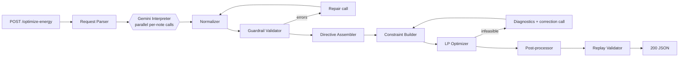

# GridWise LLM

An LLM-assisted 24-hour battery/solar/grid scheduler built for BUP CSE Fest 2026. Operator notes
in plain English are interpreted by Google Gemini into structured directives, checked by a
deterministic guardrail layer, applied as hard constraints, and solved to the exact cost optimum
with a linear program (SciPy HiGHS). See [planning.md](planning.md) for the full design.

| | |
|---|---|
| Live API | `<LIVE_URL>` — `GET /health`, `POST /optimize-energy` (see "Deployment" below) |
| Docker image | `ghcr.io/animahou/gridwise-llm:v1.0.1` (linux/amd64 + linux/arm64) |
| Public samples (live Gemini) | **10/10** interpretations exact · **10/10** plans valid vs ground truth · **10/10** optimal cost · p95 ≈ 2.0 s |
| Hallucination / paraphrase eval (live) | our 45 unseen notes: 45/45 · another team's 57 hand-labelled notes: 57/57 (after two guardrail fixes) |
| Offline test suite | 229 tests (unit, golden incl. 53 external judge-style cases, integration, 40 randomized scenarios vs an independent LP) |

## Contents

- [Architecture](#architecture)
- [Project structure](#project-structure)
- [Quickstart](#quickstart)
- [Configuration and model/provider](#configuration-and-modelprovider)
- [Public-sample test procedure](#public-sample-test-procedure)
- [Deployment (live endpoint)](#deployment-live-endpoint)
- [Docker](#docker)
- [Demo frontend](#demo-frontend-frontend)
- [The reasoning UI (debug)](#the-reasoning-ui-debug)
- [Testing](#testing)
- [Dependencies, credits, limitations](#dependencies-credits-limitations)

## Architecture



- `app/llm` — Gemini client, model fallback chain, per-note prompt building, repair loop.
- `app/guardrails` — deterministic time/quantity normalization and the Section-08 validator.
- `app/optimizer` — directive-to-bounds mapping, the LP model, and post-processing.
- `app/verification` — the judge-mirror replay validator (also usable against ground truth).
- `app/pipeline` — the end-to-end orchestrator and request deadline.
- `app/static/index.html` — a small UI for exploring the reasoning trace (see below).

## Project structure

```
.
├── app/                    FastAPI service (see Architecture above for what each module does)
│   ├── api/                routes, request parsing, error → HTTP status mapping
│   ├── schemas/             request/response/LLM-output Pydantic models
│   ├── llm/                 Gemini client, fallback chain, interpreter, prompts, cache
│   ├── guardrails/          normalizer, Section-08 validator, cross-check, rule fallback
│   ├── optimizer/           constraints → LP model → solver → post-processing
│   ├── verification/        judge-mirror replay validator
│   ├── pipeline/            end-to-end orchestrator + request deadline
│   ├── summary/             deterministic plan_summary text
│   └── static/index.html    debug reasoning UI, served at /ui/
├── frontend/               the demo UI (separate from app/static), served at /app/
├── tests/                  unit, golden, integration, property, live (see Testing below)
├── scripts/                eval, public-sample runner, secret scan, smoke test
├── docs/                   architecture/testing/deployment notes (in progress)
├── .github/workflows/      CI (lint + offline tests + secret scan) and Docker publish to GHCR
├── planning.md             the full design doc — architecture, LLM/optimizer design, rubric mapping
├── Dockerfile / docker-compose.yml
└── requirements.txt / requirements-dev.txt / pyproject.toml
```

## Quickstart

```bash
git clone <this repo>
cd BUP_Hackathon
python -m venv .venv && source .venv/bin/activate   # or .venv\Scripts\activate on Windows
pip install -r requirements.txt
cp .env.example .env   # then set GEMINI_API_KEY
uvicorn app.main:app --port 8000
```

```bash
curl http://localhost:8000/health
curl -X POST http://localhost:8000/optimize-energy \
  -H "Content-Type: application/json" \
  -d @tests/fixtures/sample_request.json
```

Then open **http://localhost:8000/ui/** in a browser for the interactive demo (see below).

## Configuration and model/provider

Get a free key at https://aistudio.google.com/apikey. Full env var reference in
[planning.md §13](planning.md#13-configuration-environment-variables); the ones you'll actually
touch:

| Variable | Default | Purpose |
|---|---|---|
| `GEMINI_API_KEY` | — | required for the LLM path; `/health` and a degraded `/optimize-energy` still work without it |
| `GEMINI_API_KEYS` | — | optional extra keys (comma-separated, other Google projects = separate quotas); a 429 on one key is retried on the next |
| `LLM_MODEL` | `gemini-flash-lite-latest` | primary model (fastest reliable model in our live tests, ~1.7 s/note) |
| `LLM_FALLBACK_MODELS` | `gemini-3.5-flash,gemini-3-flash-preview,gemini-flash-latest` | fallback chain, tried in order on 429/5xx/timeout/invalid output |
| `LLM_THINKING_BUDGET` | `-1` | `-1` = send no thinking config (some models reject `thinking_budget=0`) |
| `REQUEST_DEADLINE_S` | `25` | hard end-to-end budget (judge timeout is 30s) |
| `INFEASIBLE_POLICY` | `best_effort` | `best_effort` (elastic 200) or `error` (422) when directives can't all be satisfied |

**What the LLM does:** one call per operator note (run in parallel), producing both *evidence*
(the time window and quantity as written) and its own *final* hours/factor/etc. Deterministic code
recomputes the final values from the evidence and cross-checks them — the LLM does semantics, code
does arithmetic. See [planning.md §4](planning.md#4-llm-directive-interpretation-25-pts--deep-design).

**Guardrails:** every LLM output is validated against 13 rules (unit ranges, hour shape, dual-channel
agreement, grounding, relevance consistency) before it can reach the optimizer; failures trigger one
repair round, then the next model in the chain, then a keyword-based degraded interpreter, then a
safe `no_op` — the pipeline never crashes and never invents a directive.

**Solver:** an exact linear program (`scipy.optimize.linprog`, HiGHS) over 5 variables/hour
(grid, solar used, charge, discharge, energy-after), with a second-stage tie-break objective to
avoid pointless charge/discharge cycling at the same cost.

**Known limitations (all confirmed live against a real key, not just theoretical):**
- The chain uses `-latest` model aliases rather than pinned version numbers. Google deprecates
  specific dated models for new API keys on a rolling basis — we hit this directly:
  `gemini-2.5-pro`/`-flash`/`-flash-lite` all 404'd for our test key with a message pointing at a
  newer model — and an alias survives that.
- **`gemini-pro-latest`'s free-tier quota 429'd on the very first call.** Not used by default;
  set `LLM_MODEL=gemini-pro-latest` if you want to try it (e.g. after enabling billing) and
  re-run the bake-off.
- **`gemini-flash-latest` was unreliable under our actual structured-output workload** (503/504
  under a few different real calls) even though a plain unstructured call to it succeeded, while
  `gemini-flash-lite-latest` answered every real note correctly and in 2-3s. That's why
  **flash-lite, not flash, is the default primary** — accuracy on paper doesn't matter if the
  model can't reliably answer. Re-check this if Google's routing behind the aliases changes.
- `thinking_budget=0` is rejected (400) by `gemini-flash-lite-latest`. The default is now to send
  no thinking config at all; if a model still rejects one, the client remembers that per model and
  never sends it again (no wasted round-trip per note).
- **Free-tier keys allow only 15 requests/minute per model.** Each note is one call, so a free key
  saturates after ~5 requests/minute. The service survives this (key rotation → next model →
  wait for the server-suggested retry delay → rule-based fallback), but **enable billing on the
  Google project for judging** so every note is answered by the LLM.
- Degraded results (LLM unreachable) are never cached, so a burst of 429s cannot permanently turn
  a directive into `no_op`.

## Public-sample test procedure

`tests/fixtures/public_samples.json` is an unmodified copy of the official pack. With the service
running (locally or deployed):

```bash
python scripts/run_public_samples.py --base-url http://localhost:8000
```

It POSTs every case, then scores the response like the judge: interpretation vs ground truth
(type/hours/values/shape), the plan replayed against the **ground-truth** directives (tol 0.01),
recomputed totals, and cost vs the reference optimum. Expected (and observed) result:

```
SAMPLE-01: PASS  2.01s  cost=38365.000001 ref=38365
...
SAMPLE-10: PASS  1.95s  cost=41620.000001 ref=41620

interpretation exact: 10/10 | plans valid vs ground truth: 10/10 | optimal cost: 10/10 | p50 1.91s p95 2.01s
```

Offline (no key), the same 10 cases run end to end through the full pipeline with a fake LLM:
`pytest tests/golden`.

LLM robustness (hallucination / paraphrase) eval on 45 unseen notes — reworded directives, units
(kW/MWh/% SOC), fractions, "X less than forecast", wrap-around/`through`/`before` windows, past and
future-day distractors, unsupported requests, a prompt-injection attempt and a Bangla note:

```bash
python scripts/eval_interpreter.py --concurrency 2
```

## Deployment (live endpoint)

Any Docker host works. Railway (always-on, HTTPS) is the quickest:

1. railway.app → New Project → Deploy from GitHub repo → `AniMahou/BUP_Hackathon` (Dockerfile is detected).
2. Variables: `GEMINI_API_KEY` (and optionally `GEMINI_API_KEYS`); `PORT` is injected by Railway.
3. Settings → Networking → Generate Domain; health check path `/health`.
4. Verify from outside: `bash scripts/smoke_test.sh https://<domain>` and
   `python scripts/run_public_samples.py --base-url https://<domain>`.

Render works the same way (New → Web Service → Docker; use a paid instance, the free tier sleeps).

## Docker

```bash
docker build -t gridwise-llm:local .
docker run --rm -p 8000:8000 -e GEMINI_API_KEY=... gridwise-llm:local
curl http://localhost:8000/health
```

Multi-arch publish: `docker buildx build --platform linux/amd64,linux/arm64 -t <you>/gridwise-llm:1.0.0 --push .`
(or push a `v*` tag — `.github/workflows/docker-publish.yml` builds and pushes automatically to
`ghcr.io/<owner>/gridwise-llm` using the repo's built-in token, no extra secrets needed).

**GHCR packages default to private.** After the first successful run, go to the package's
GitHub page (linked from the repo sidebar under "Packages") → Package settings → change
visibility to **Public** — otherwise judges can't `docker pull` it anonymously, which is exactly
what the rubric checks (§9 of planning.md). `.github/workflows/ci.yml` runs lint + offline tests +
secret scan on every push/PR; both workflow files were empty scaffold placeholders until this was
filled in — if you see an old GitHub Actions failure email predating this, that's why.

## Demo frontend (`frontend/`)

A single-page demo app built from our Google Stitch designs (plain HTML + Tailwind CDN + Chart.js,
no build step), with a **dark/light theme toggle** (top-right). Seven screens, all driven by real API
responses: **Run** (samples, editable battery, 1–3 notes) → **Processing** (live pipeline) →
**Understand** (note → rule card with 24-hour strip, guardrail ticks, model used, auto-correction /
fallback tags) → **Plan** (KPIs + energy-mix / battery / price charts with directive bands) →
**Verify** (7 judge rules re-checked in the browser) → **Details** (hourly table, raw JSON, trace)
→ **How it works**.

- Same origin (simplest): start the backend, open `http://localhost:8000/app/`.
- Standalone: `python -m http.server 5500 -d frontend`, open
  `http://127.0.0.1:5500/?api=http://127.0.0.1:8000`.

It calls `POST /ui/optimize` (identical pipeline to `/optimize-energy`, plus a reasoning trace) and
`GET /ui/info`; the judged endpoints are untouched.

## The reasoning UI (debug)

`http://localhost:8000/ui/` is a small single-page app (plain HTML/CSS/JS, no build step) for
exploring the pipeline interactively: type 1-3 operator notes (a default 24-hour scenario is
pre-filled and editable under "Advanced"), click **Interpret & Optimize**, and watch:

- a per-note reasoning timeline (cache hits, the model's own analysis, guardrail issues, repair
  rounds, which model ultimately answered, degraded-mode fallbacks);
- the overall pipeline stages (interpretation → constraint building → LP solve → infeasibility
  handling if any → post-processing → self-check);
- the final 24-hour plan as a chart and table, plus totals and the plan summary.

It talks to `POST /ui/optimize`, a debug-only endpoint that runs the identical pipeline as
`POST /optimize-energy` and adds a `trace` field — the graded contract endpoint's response shape
is untouched.

## Testing

```bash
pytest -m "not live"      # unit + property + golden + integration (no API key needed, fake LLM)
pytest -m live            # needs a real GEMINI_API_KEY (calls Gemini)
ruff check .
```

Layers (172 offline tests, ~1.5 s):
- **unit** — normalizer, guardrail validator, constraints, LP, post-processor, replay validator;
- **golden** — all 10 official public samples end to end (interpretation, plan validity vs ground
  truth, exact reference cost, response key order);
- **integration / edge cases** (`tests/integration/test_edge_cases.py`) — API contract and exact
  key order, a 21-case 400 matrix and 6-case 422 matrix, extra/unordered/int fields accepted,
  40 randomized scenarios checked against an independently written LP (validity + optimal cost),
  rule-fallback paraphrases and distractors, rate-limit fallback / wait-and-retry, "degraded results
  are never cached", hedges never double-apply, key rotation, extreme inputs (no battery, zero
  rates, min = capacity, zero demand, flat/negative tariffs, huge solar, float noise), and
  infeasible directives (no crash);
- **live** — `scripts/run_public_samples.py` and `scripts/eval_interpreter.py` (real Gemini).

## Dependencies, credits, limitations

Runtime: FastAPI, Pydantic v2, NumPy, SciPy (HiGHS), `google-genai`. Dev: pytest, Hypothesis,
httpx, ruff. Built with the assistance of Claude Code (Anthropic).

- The Gemini free tier's rate limits are the main operational risk under judging load (see above).
- Remaining LLM miss in our eval: "panels will produce three-quarters less than forecast" was once
  read as factor 0 (now covered by an explicit prompt rule; the plan stays valid either way because
  a lower factor is the stricter reading).
- Windows crossing midnight (e.g. "11 PM until 1 AM") are applied to both ends of the same 24-hour
  day ([0, 23]); this is a documented policy, since the problem statement does not define it.
- Secrets live only in environment variables; `.dockerignore`/`.gitignore` exclude `.env*`; logs
  redact Google (`AIza…`, `AQ.…`) and `sk-…` key patterns; `scripts/check_secrets.sh` runs in CI.
