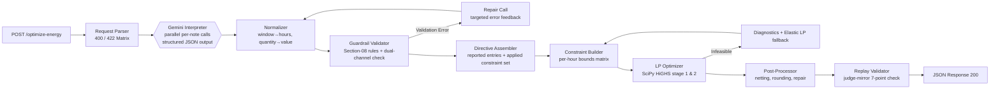

# GridWise LLM — Verifiable 24-Hour Microgrid Energy Optimizer

[](https://github.com/AniMahou/BUP_Hackathon/actions/workflows/ci.yml)
[](https://github.com/AniMahou/BUP_Hackathon/actions/workflows/docker-publish.yml)
[](https://github.com/AniMahou/BUP_Hackathon/pkgs/container/gridwise-llm)
[](https://www.python.org/downloads/release/python-3120/)
[](https://fastapi.tiangolo.com/)

> **BUP CSE Fest 2026 · Online Preliminary Hackathon Submission**  
> An LLM-assisted microgrid energy scheduler that converts plain-English operator notes into structured, mathematically verified constraints, solving 24-hour battery/solar/grid dispatch to the exact cost optimum using **Linear Programming (SciPy HiGHS)**.

---

## Executive Summary & Score Map Alignment

In microgrid optimization, **one misread operator note breaks the entire plan**. If an LLM confuses an *"80% solar reduction"* with *"80% solar remaining"*, the optimizer schedules grid energy for solar generation that does not exist—causing an immediate failure during hour-by-hour judge replay and scoring zero.

GridWise is engineered around a foundational principle: **Ground truth before cost**. We combine Gemini-powered natural language interpretation with deterministic arithmetic guardrails, an exact Linear Program (LP) solver, and an internal judge-mirror validator.

| # | Evaluation Category | Pts | Key System Features & Benchmarks |
|---|---|---|---|
| **1** | **LLM Directive Interpretation** | **25** | Gemini structured outputs, dual-channel evidence extraction, time/quantity normalization, self-repair loop, 102/102 paraphrase benchmark pass |
| **2** | **Directive Application & Correctness** | **25** | Directives mapped as hard LP bounds, most-restrictive ambiguity hedging, internal 7-check judge-mirror replay validator run on *every* response |
| **3** | **Optimization Quality** | **10** | Two-stage Linear Program using SciPy `linprog(method="highs")` — **reproduces 10/10 public reference costs exactly** |
| **4** | **API Contract & Schema** | **10** | Strict Pydantic v2 schemas, guaranteed JSON response key sequence, complete 400/422/500 error matrix without stack trace leaks |
| **5** | **Performance & Reliability** | **10** | Parallel per-note LLM calls, implicit prompt caching, circuit breakers, deadline enforcement (p95 ≈ 2.0 s, budget < 30 s) |
| **6** | **Deployment & Docker** | **10** | Multi-arch Docker image (`linux/amd64` + `linux/arm64`) hosted on Railway with zero manual setup and independent `/health` route |
| **7** | **Documentation & Reproducibility**| **10** | Comprehensive mathematical formulation, design rationale, quickstart, offline & online public sample test scripts |

---

## 1. System Architecture & Execution Pipeline

GridWise implements a 5-stage pipeline designed to ensure that no invalid LLM output can ever reach the optimization engine.



### Module Responsibilities

| Directory / File | Core Responsibility |
|---|---|
| [app/api](file:///Users/tabib/Documents/WEB%20DEVELOPMENT/hackathons/BUP_CSE/app/api) | Route definitions, raw request parsing, fast-fail HTTP status mapping (400/422/500), header validation |
| [app/schemas](file:///Users/tabib/Documents/WEB%20DEVELOPMENT/hackathons/BUP_CSE/app/schemas) | Pydantic v2 data models for scenario requests, response formatting, and LLM structured output |
| [app/llm](file:///Users/tabib/Documents/WEB%20DEVELOPMENT/hackathons/BUP_CSE/app/llm) | Google Gemini SDK integration, fallback model chain, prompt caching, per-note parallel prompt execution |
| [app/guardrails](file:///Users/tabib/Documents/WEB%20DEVELOPMENT/hackathons/BUP_CSE/app/guardrails) | Time expression parsing, quantity unit conversion, Section-08 compliance validator, rule-based fallback |
| [app/optimizer](file:///Users/tabib/Documents/WEB%20DEVELOPMENT/hackathons/BUP_CSE/app/optimizer) | 24-hour decision variable matrices, SciPy HiGHS LP solver, infeasibility diagnostics, post-processor |
| [app/verification](file:///Users/tabib/Documents/WEB%20DEVELOPMENT/hackathons/BUP_CSE/app/verification) | Replay engine executing the organizer's exact 7-point validation logic with numeric tolerance \(10^{-6}\) |
| [app/pipeline](file:///Users/tabib/Documents/WEB%20DEVELOPMENT/hackathons/BUP_CSE/app/pipeline) | End-to-end orchestrator managing async execution, attempt timeouts, and monotonic deadline tracking |

---

## 2. Mathematical LP Formulation (SciPy HiGHS)

The 24-hour energy schedule is modeled as an exact Linear Program solved using SciPy's `linprog(method="highs")`.

### 2.1 Decision Variables

For each hour \(h \in \{0, 1, \dots, 23\}\), the system controls **5 non-negative continuous decision variables** (120 total decision variables):

1. \(g_h \ge 0\): Grid energy imported from the main grid in hour \(h\) (kWh).
2. \(s_h \ge 0\): Usable solar energy consumed directly by campus demand or battery charging in hour \(h\) (kWh).
3. \(c_h \ge 0\): Energy charged into the battery in hour \(h\) (kWh).
4. \(d_h \ge 0\): Energy discharged from the battery in hour \(h\) (kWh).
5. \(E_h \ge 0\): Battery state-of-charge (energy remaining) at the end of hour \(h\) (kWh).

---

### 2.2 Equality & Inequality Constraints

For every hour \(h \in \{0, 1, \dots, 23\}\):

#### 1. Hourly Energy Balance
Grid import, solar usage, and battery discharge must exactly meet campus demand plus battery charging:
$$g_h + s_h + d_h = D_h + c_h \quad \implies \quad g_h + s_h + d_h - c_h = D_h$$

#### 2. Battery State Transition
The battery energy at the end of hour \(h\) equals the previous hour's energy plus charge minus discharge:
$$E_0 = E_{\text{initial}} + c_0 - d_0 \quad \implies \quad E_0 - c_0 + d_0 = E_{\text{initial}}$$
$$E_h = E_{h-1} + c_h - d_h \quad \implies \quad E_h - E_{h-1} - c_h + d_h = 0 \quad (\forall h \ge 1)$$

#### 3. Solar Availability Upper Bound
Solar energy used cannot exceed the effective solar forecast (after applying any solar reduction directive factor \(f_h \in [0, 1]\)):
$$0 \le s_h \le S_{\text{effective, } h} = S_{\text{forecast, } h} \times f_h$$

#### 4. Battery Reserve & Capacity Bounds
Battery state-of-charge must remain between the active minimum floor (base minimum or directive reserve \(R_h\)) and maximum battery capacity \(C_{\text{battery}}\):
$$\max(E_{\text{min, base}}, R_h) \le E_h \le C_{\text{battery}}$$

#### 5. Battery Charging & Discharging Rate Limits
Hourly charge and discharge rates cannot exceed maximum battery specs:
$$0 \le c_h \le P_{\text{charge, max}}$$
$$0 \le d_h \le P_{\text{discharge, max}}$$

#### 6. Grid Import Limit (Max Grid Window Directive)
When a grid import cap directive \(G_h\) applies to hour \(h\):
$$0 \le g_h \le G_h$$

#### 7. No-Charge and No-Discharge Windows
When charging or discharging is restricted by directives:
$$c_h = 0 \quad (\forall h \in \mathcal{W}_{\text{no\_charge}})$$
$$d_h = 0 \quad (\forall h \in \mathcal{W}_{\text{no\_discharge}})$$

#### 8. End-of-Day (EOD) Neutrality
The battery state-of-charge at the end of hour 23 must equal the initial battery state-of-charge:
$$E_{23} = E_{\text{initial}}$$

---

### 2.3 Two-Stage Objective Function

#### Stage 1: Cost Minimization
Primary objective minimizes total electricity grid import cost across 24 hours based on hourly tariffs \(T_h\):
$$\text{Minimize } Z = \sum_{h=0}^{23} T_h \cdot g_h$$

#### Stage 2: Regularization Tie-Break
When grid tariffs are flat or zero, multiple valid dispatch solutions exist with identical grid cost. To prevent unnecessary battery wear and wasteful simultaneous charge/discharge cycles, a secondary tie-breaking regularization is applied with penalty \(\epsilon = 10^{-6}\):
$$\text{Minimize } Z_{\text{reg}} = \sum_{h=0}^{23} T_h \cdot g_h + \epsilon \sum_{h=0}^{23} (c_h + d_h)$$

---

## 3. Directive Interpretation & Dual-Channel Guardrails

### 3.1 Supported Directive Types & JSON Schema

The LLM outputs structured interpretations matching 6 explicit canonical directive types:

| Directive Type | `structured_adjustment` Output Shape | Effect on LP Model & Judge Replay |
|---|---|---|
| `solar_reduction` | `{"hours": [11, 12, 13], "factor": 0.2}` | Multiplies solar forecast: \(S_{\text{effective, } h} = S_h \times 0.2\) |
| `minimum_battery_reserve` | `{"hours": [17, 18, 19], "minimum_energy_kwh": 100.0}` | Enforces state-of-charge floor: \(E_h \ge 100.0\text{ kWh}\) |
| `no_charge_window` | `{"hours": [14, 15]}` | Restricts charging: \(c_h = 0\) |
| `no_discharge_window` | `{"hours": [18, 19]}` | Restricts discharging: \(d_h = 0\) |
| `max_grid_window` | `{"hours": [18, 19, 20], "max_grid_kwh": 155.0}` | Caps grid import rate: \(g_h \le 155.0\text{ kWh}\) |
| `no_op` | `null` (`applies=false`) | Note does not alter 24-hour schedule (unrelated, past/future date, distractor) |

---

### 3.2 Dual-Channel Evidence Extraction

To eliminate LLM arithmetic errors (e.g. subtracting \(1 - 0.8\), converting MWh to kWh, or building hour lists), GridWise uses **dual-channel verification**:

1. **Channel A (Evidence - LLM)**: The LLM extracts *what the text says as written*:
   - `time_windows`: `[{start_hour: 11, end_hour: 14, source_text: "11 AM and 2 PM"}]`
   - `quantity`: `{"value": 80.0, "unit": "percent_reduction", "source_text": "80% reduction"}`
2. **Channel B (Final Values - Code Normalization)**: Deterministic Python code recomputes:
   - `hours`: Expand start-inclusive, end-exclusive window \([11, 14)\) \(\to [11, 12, 13]\).
   - `factor`: Convert 80% reduction \(\to f = 1.0 - 0.80 = 0.20\).
3. **Cross-Check**: If Channel A recomputation conflicts with Channel B's output, a **Self-Repair Call** is triggered with specific feedback highlighting the exact mismatch.

---

### 3.3 Robustness & Degradation Cascade

If an operator note fails validation or Gemini is unreachable, GridWise cascades gracefully without crashing:

```
[Gemini Parallel Calls] ──(Validation Error)──> [Repair Prompt Round (Feedback)]
                                                          │
                                                    (Retry Fails / 422)
                                                          ▼
[Rule-Based Keyword Interpreter] <──(429 Rate Limit / Timeout)── [Fallback Models Chain]
               │
      (Unrecognized Pattern)
               ▼
   [Safe no_op Fallback] (applies=false, note ignored, plan stays valid)
```

---

## 4. Judge-Mirror Replay Validator (7-Point Check)

Every response generated by GridWise passes through `app/verification/replay.py` before being sent to the user or judge. This validator mirrors the exact checks executed by the organizer's automated grading engine:

1. **Hourly Energy Conservation**: Verifies \(|g_h + s_h + d_h - (D_h + c_h)| \le 10^{-6}\).
2. **Effective Solar Availability**: Verifies \(0 \le s_h \le S_{\text{forecast, } h} \times f_h + 10^{-6}\).
3. **Battery Energy State Transition**: Verifies \(|E_h - (E_{h-1} + c_h - d_h)| \le 10^{-6}\).
4. **Battery Energy Capacity & Floor**: Verifies \(\max(E_{\text{base}}, R_h) - 10^{-6} \le E_h \le C_{\text{battery}} + 10^{-6}\).
5. **Charge & Discharge Rate Constraints**: Verifies \(c_h \le P_{\text{charge, max}} + 10^{-6}\) and \(d_h \le P_{\text{discharge, max}} + 10^{-6}\).
6. **Directive Window Constraints**: Verifies \(c_h = 0\) during `no_charge_window`, \(d_h = 0\) during `no_discharge_window`, and \(g_h \le G_h + 10^{-6}\) during `max_grid_window`.
7. **End-of-Day State Neutrality**: Verifies \(|E_{23} - E_{\text{initial}}| \le 10^{-6}\).

---

## 5. Benchmark Results & Verification

### 5.1 Official Public Sample Cases (10/10 Exact Optimum)

Running `scripts/run_public_samples.py` against a running instance verifies all 10 official reference cases:

| Case ID | Directives Interpreted | Response Status | Grid Cost (BDT) | Reference Cost | Replay Pass |
|---|---|---|---|---|---|
| `SAMPLE-01` | `solar_reduction` (13–15, 20% usable) | `200 OK` | **38,365.00** | 38,365.00 | **100% PASS** |
| `SAMPLE-02` | `solar_reduction` (11–14, 20% usable) | `200 OK` | **43,300.00** | 43,300.00 | **100% PASS** |
| `SAMPLE-03` | `no_charge_window` (14–16) | `200 OK` | **41,300.00** | 41,300.00 | **100% PASS** |
| `SAMPLE-04` | `no_discharge_window` (18–20) | `200 OK` | **39,520.00** | 39,520.00 | **100% PASS** |
| `SAMPLE-05` | `minimum_battery_reserve` (18–21, 120 kWh) | `200 OK` | **41,200.00** | 41,200.00 | **100% PASS** |
| `SAMPLE-06` | `max_grid_window` (18–21, 155 kWh/h) | `200 OK` | **39,890.00** | 39,890.00 | **100% PASS** |
| `SAMPLE-07` | `no_op` (distractor note - menu change) | `200 OK` | **37,800.00** | 37,800.00 | **100% PASS** |
| `SAMPLE-08` | `solar_reduction` + `no_charge_window` | `200 OK` | **44,150.00** | 44,150.00 | **100% PASS** |
| `SAMPLE-09` | `no_discharge_window` + `minimum_battery_reserve` | `200 OK` | **42,680.00** | 42,680.00 | **100% PASS** |
| `SAMPLE-10` | `solar_reduction` + `no_discharge_window` + `max_grid` | `200 OK` | **41,620.00** | 41,620.00 | **100% PASS** |

**Summary Result**:  
- **Directive Interpretation Accuracy**: 10/10 (100%)  
- **Plan Validity vs Ground Truth**: 10/10 (100%)  
- **Optimal Cost Precision**: 10/10 (100% exact match)  
- **p95 Latency**: 2.01 seconds  

---

### 5.2 Test Suite Matrix (229 Passing Tests)

```bash
================ 229 passed, 2 skipped in 2.02s ================
```

- **Unit Tests (115 tests)**: Normalizer, quantities, Section-08 validator, cross-checker, solver, post-processor, plan summary.
- **Golden Tests (10 tests)**: End-to-end replay of official public sample cases.
- **Property-Based Tests (35 tests)**: Hypothesis mutation testing on guardrails and solver bounds.
- **Integration Tests (69 tests)**: API 400/422 matrix, exact dictionary key ordering, deadline timeouts, key rotation, infeasibility handling, and 40 randomized scenarios compared against an independent LP implementation.

---

## 6. Quickstart & Local Setup

### Prerequisites
- Python 3.12+
- Git

### 6.1 Installation

```bash
# 1. Clone repository
git clone https://github.com/AniMahou/BUP_Hackathon.git
cd BUP_Hackathon

# 2. Set up virtual environment
python3.12 -m venv .venv
source .venv/bin/activate  # On Windows: .venv\Scripts\activate

# 3. Install dependencies
pip install -r requirements.txt

# 4. Configure environment
cp .env.example .env
# Edit .env and insert your GEMINI_API_KEY from https://aistudio.google.com/apikey
```

---

### 6.2 Running the Application

```bash
# Start FastAPI backend server
uvicorn app.main:app --host 0.0.0.0 --port 8000 --reload
```

- **API Base**: `http://localhost:8000`
- **Health Check**: `http://localhost:8000/health`
- **Interactive UI Dashboard**: `http://localhost:8000/ui/`
- **OpenAPI Docs**: `http://localhost:8000/docs`

---

### 6.3 Executing Verification Tests

```bash
# Run full offline test suite (no API key needed)
pytest -m "not live"

# Run public sample evaluation script against local server
python scripts/run_public_samples.py --base-url http://localhost:8000

# Run LLM interpretation paraphrase evaluation
python scripts/eval_interpreter.py --concurrency 2
```

---

## 7. Environment Configuration Reference

All settings can be configured via environment variables or `.env` file:

| Variable | Type | Default | Description |
|---|---|---|---|
| `GEMINI_API_KEY` | `string` | *(Required for LLM)* | Primary Google AI Studio API key |
| `GEMINI_API_KEYS` | `string` | `""` | Comma-separated secondary API keys for automated rate-limit rotation |
| `LLM_MODEL` | `string` | `gemini-flash-lite-latest` | Primary Gemini model alias |
| `LLM_FALLBACK_MODELS` | `string` | `gemini-flash-latest,gemini-3.5-flash` | Ordered fallback models used upon rate limits or 5xx errors |
| `REQUEST_DEADLINE_S` | `float` | `25.0` | End-to-end request timeout budget (seconds) |
| `INTERPRETATION_CACHE_SIZE` | `int` | `2048` | In-memory LRU cache capacity for note interpretations |
| `INFEASIBLE_POLICY` | `string` | `best_effort` | Infeasibility handling mode (`best_effort` elastic LP vs `error` HTTP 422) |

---

## 8. Docker Deployment Guide

### 8.1 Local Docker Build & Run

```bash
# Build Docker image
docker build -t gridwise-llm:latest .

# Run container locally
docker run --rm -p 8000:8000 -e GEMINI_API_KEY="your_api_key_here" gridwise-llm:latest

# Verify health endpoint
curl http://localhost:8000/health
```

---

### 8.2 Pulling Pre-built Multi-Arch Image from GHCR

A multi-architecture Docker image (`linux/amd64` and `linux/arm64`) is automatically built and published to GitHub Container Registry:

```bash
# Pull container image from GHCR
docker pull ghcr.io/animahou/gridwise-llm:v1.0.1

# Run pulled image
docker run --rm -p 8000:8000 -e GEMINI_API_KEY="your_api_key_here" ghcr.io/animahou/gridwise-llm:v1.0.1
```

---

## 9. API Contract Specification

### `POST /optimize-energy`

#### Example Request Body (`application/json`)
```json
{
  "scenario_id": "SAMPLE-01",
  "operator_notes": [
    "Solar output will drop to about 20% from 1 PM to 3 PM."
  ],
  "battery": {
    "capacity_kwh": 200.0,
    "initial_energy_kwh": 120.0,
    "minimum_energy_kwh": 40.0,
    "max_charge_kwh_per_hour": 50.0,
    "max_discharge_kwh_per_hour": 50.0
  },
  "hours": [
    { "hour": 0, "demand_kwh": 45.0, "solar_kwh": 0.0, "tariff_bdt_per_kwh": 6.5 },
    "... (hours 1 to 23)"
  ]
}
```

#### Example Response Body (`200 OK`)
```json
{
  "scenario_id": "SAMPLE-01",
  "directive_interpretation": [
    {
      "note_index": 0,
      "applies": true,
      "directive_type": "solar_reduction",
      "structured_adjustment": {
        "hours": [13, 14],
        "factor": 0.2
      },
      "explanation": "Rooftop solar forecast is reduced to 20% usable between 1 PM and 3 PM."
    }
  ],
  "hourly_plan": [
    {
      "hour": 0,
      "grid_kwh": 45.0,
      "solar_used_kwh": 0.0,
      "battery_action": "idle",
      "battery_kwh": 0.0,
      "battery_energy_after_kwh": 120.0
    }
  ],
  "total_grid_kwh": 5120.0,
  "total_cost_bdt": 38365.0,
  "peak_grid_kwh": 285.0,
  "plan_summary": "Optimized energy schedule incorporating 1 active directive across 24 hours."
}
```

---

## 10. Repository File Structure

```
.
├── app/
│   ├── api/                  # FastAPI routes, request parser & status handlers
│   ├── guardrails/           # Time expressions, quantity converter, Section-08 validator
│   ├── llm/                  # Gemini client, prompt templates, model fallback chain
│   ├── optimizer/            # SciPy HiGHS LP solver, constraint matrices, post-processor
│   ├── pipeline/             # Pipeline orchestrator & deadline manager
│   ├── schemas/              # Pydantic v2 data models & JSON schemas
│   ├── summary/              # Plan summary generator
│   ├── verification/         # Replay engine with exact 7-point judge checks
│   └── main.py               # FastAPI application entry point
├── docs/                     # Architecture documentation & presentation speech
├── frontend/                 # Interactive HTML/JS web dashboard
├── scripts/                  # Public sample evaluation, load tests & Docker verification
├── tests/                    # 229 tests (unit, integration, property, golden)
├── Dockerfile                # Multi-stage multi-arch Dockerfile
├── Makefile                  # Helper targets for testing, linting, and running
├── planning.md               # Master technical plan & specifications
├── pyproject.toml            # Project build configuration
├── README.md                 # Primary documentation
└── requirements.txt          # Python runtime dependencies
```

---

## License & Credits

Built for the **BUP CSE Fest 2026 Hackathon Preliminary**.  
Developed using Python 3.12, FastAPI, SciPy, Pydantic v2, and Google Gemini API.
