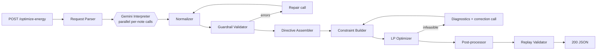

# GridWise LLM

An LLM-assisted 24-hour battery/solar/grid scheduler built for BUP CSE Fest 2026. Operator notes
in plain English are interpreted by Google Gemini into structured directives, checked by a
deterministic guardrail layer, applied as hard constraints, and solved to the exact cost optimum
with a linear program (SciPy HiGHS). See [planning.md](planning.md) for the full design.

## Architecture



- `app/llm` — Gemini client, model fallback chain, per-note prompt building, repair loop.
- `app/guardrails` — deterministic time/quantity normalization and the Section-08 validator.
- `app/optimizer` — directive-to-bounds mapping, the LP model, and post-processing.
- `app/verification` — the judge-mirror replay validator (also usable against ground truth).
- `app/pipeline` — the end-to-end orchestrator and request deadline.
- `app/static/index.html` — a small UI for exploring the reasoning trace (see below).

## Quickstart

```bash
git clone <this repo>
cd BUP_Hackathon
python -m venv .venv && source .venv/bin/activate   # or .venv\Scripts\activate on Windows
pip install -r requirements.txt
cp .env.example .env   # then set GEMINI_API_KEY
uvicorn app.main:app --port 8000
```

```bash
curl http://localhost:8000/health
curl -X POST http://localhost:8000/optimize-energy \
  -H "Content-Type: application/json" \
  -d @tests/fixtures/sample_request.json
```

Then open **http://localhost:8000/ui/** in a browser for the interactive demo (see below).

## Configuration and model/provider

Get a free key at https://aistudio.google.com/apikey. Full env var reference in
[planning.md §13](planning.md#13-configuration-environment-variables); the ones you'll actually
touch:

| Variable | Default | Purpose |
|---|---|---|
| `GEMINI_API_KEY` | — | required for the LLM path; `/health` and a degraded `/optimize-energy` still work without it |
| `LLM_MODEL` | `gemini-flash-lite-latest` | primary model |
| `LLM_FALLBACK_MODELS` | `gemini-flash-latest` | fallback chain |
| `REQUEST_DEADLINE_S` | `25` | hard end-to-end budget (judge timeout is 30s) |
| `INFEASIBLE_POLICY` | `best_effort` | `best_effort` (elastic 200) or `error` (422) when directives can't all be satisfied |

**What the LLM does:** one call per operator note (run in parallel), producing both *evidence*
(the time window and quantity as written) and its own *final* hours/factor/etc. Deterministic code
recomputes the final values from the evidence and cross-checks them — the LLM does semantics, code
does arithmetic. See [planning.md §4](planning.md#4-llm-directive-interpretation-25-pts--deep-design).

**Guardrails:** every LLM output is validated against 13 rules (unit ranges, hour shape, dual-channel
agreement, grounding, relevance consistency) before it can reach the optimizer; failures trigger one
repair round, then the next model in the chain, then a keyword-based degraded interpreter, then a
safe `no_op` — the pipeline never crashes and never invents a directive.

**Solver:** an exact linear program (`scipy.optimize.linprog`, HiGHS) over 5 variables/hour
(grid, solar used, charge, discharge, energy-after), with a second-stage tie-break objective to
avoid pointless charge/discharge cycling at the same cost.

**Known limitations (all confirmed live against a real key, not just theoretical):**
- The chain uses `-latest` model aliases rather than pinned version numbers. Google deprecates
  specific dated models for new API keys on a rolling basis — we hit this directly:
  `gemini-2.5-pro`/`-flash`/`-flash-lite` all 404'd for our test key with a message pointing at a
  newer model — and an alias survives that.
- **`gemini-pro-latest`'s free-tier quota 429'd on the very first call.** Not used by default;
  set `LLM_MODEL=gemini-pro-latest` if you want to try it (e.g. after enabling billing) and
  re-run the bake-off.
- **`gemini-flash-latest` was unreliable under our actual structured-output workload** (503/504
  under a few different real calls) even though a plain unstructured call to it succeeded, while
  `gemini-flash-lite-latest` answered every real note correctly and in 2-3s. That's why
  **flash-lite, not flash, is the default primary** — accuracy on paper doesn't matter if the
  model can't reliably answer. Re-check this if Google's routing behind the aliases changes.
- `thinking_budget=0` was rejected (400) by `gemini-flash-lite-latest` at one point while accepted
  by `gemini-flash-latest`; `gemini_client.py` retries once with no thinking config at all on a
  400 rather than let that permanently circuit-break a model that otherwise works.
- If you see repeated `429`s under real load on any model, enable pay-as-you-go billing on the
  same project.

## Public-sample test procedure

The official "Public Sample Cases" pack was not available while this was built — drop it at
`tests/fixtures/public_samples.json` (shape documented in `scripts/run_public_samples.py`'s
docstring) and run:

```bash
python scripts/run_public_samples.py --base-url http://localhost:8000
```

Expected result: every case reports `PASS` (valid vs. ground truth, cost within 0.01 of the
reference). Until that file is populated, `tests/golden/test_public_samples_offline.py` skips
itself rather than fake a result.

## Docker

```bash
docker build -t gridwise-llm:local .
docker run --rm -p 8000:8000 -e GEMINI_API_KEY=... gridwise-llm:local
curl http://localhost:8000/health
```

Multi-arch publish: `docker buildx build --platform linux/amd64,linux/arm64 -t <you>/gridwise-llm:1.0.0 --push .`
(or push a `v*` tag — `.github/workflows/docker-publish.yml` builds and pushes automatically to
`ghcr.io/<owner>/gridwise-llm` using the repo's built-in token, no extra secrets needed).

**GHCR packages default to private.** After the first successful run, go to the package's
GitHub page (linked from the repo sidebar under "Packages") → Package settings → change
visibility to **Public** — otherwise judges can't `docker pull` it anonymously, which is exactly
what the rubric checks (§9 of planning.md). `.github/workflows/ci.yml` runs lint + offline tests +
secret scan on every push/PR; both workflow files were empty scaffold placeholders until this was
filled in — if you see an old GitHub Actions failure email predating this, that's why.

## The reasoning UI

`http://localhost:8000/ui/` is a small single-page app (plain HTML/CSS/JS, no build step) for
exploring the pipeline interactively: type 1-3 operator notes (a default 24-hour scenario is
pre-filled and editable under "Advanced"), click **Interpret & Optimize**, and watch:

- a per-note reasoning timeline (cache hits, the model's own analysis, guardrail issues, repair
  rounds, which model ultimately answered, degraded-mode fallbacks);
- the overall pipeline stages (interpretation → constraint building → LP solve → infeasibility
  handling if any → post-processing → self-check);
- the final 24-hour plan as a chart and table, plus totals and the plan summary.

It talks to `POST /ui/optimize`, a debug-only endpoint that runs the identical pipeline as
`POST /optimize-energy` and adds a `trace` field — the graded contract endpoint's response shape
is untouched.

## Testing

```bash
pytest -m "not live"      # unit + property + golden + integration (no API key needed, fake LLM)
pytest -m live            # needs a real GEMINI_API_KEY (calls Gemini)
ruff check .
```

Layers: unit tests for every pure function (normalizer, guardrail validator, constraints, LP,
post-processor, replay validator), an integration suite that drives the full pipeline through a
scripted fake LLM (including total-outage and infeasibility paths), and a golden suite against the
official sample pack once it's dropped in.

## Dependencies, credits, limitations

Runtime: FastAPI, Pydantic v2, NumPy, SciPy (HiGHS), `google-genai`. Dev: pytest, Hypothesis,
httpx, ruff. Built with the assistance of Claude Code (Anthropic).

- The Gemini free tier's rate limits are the main operational risk under judging load (see above).
- The paraphrase eval corpus, synthetic E2E generator, and mutation-test suite described in
  `planning.md` §10 are scaffolded (`scripts/eval_interpreter.py`,
  `scripts/generate_scenarios.py`, `tests/property/`) but not fully populated — see that file for
  what's there.
- Secrets live only in environment variables; `.dockerignore`/`.gitignore` exclude `.env*`; logs
  redact anything matching a Google API key pattern.
